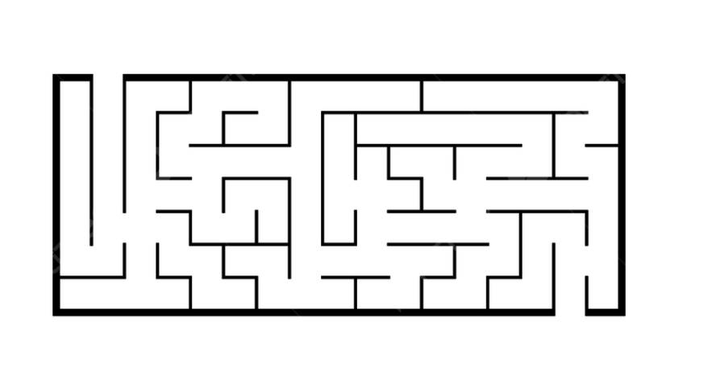

---
## Front matter
lang: ru-RU
title: "Доклад по теме: Эвристика" 
subtitle: 
author: |
        Выполнила: Коняева Марина Александврона
        \
        Преподаватель Кулябов Дмитрий Сергеевич д.ф.-м.н.,
        \ 
        профессор кафедры прикладной информатики и теории вероятностей
institute: |
           Российский университет дружбы народов, Москва, Россия
date: |
      2024

babel-lang: russian
babel-otherlangs: english
mainfont: Arial
monofont: Courier New
fontsize: 9pt

## Formatting
toc: false
slide_level: 2
theme: metropolis
header-includes: 
 - \metroset{progressbar=frametitle,sectionpage=progressbar,numbering=fraction}
 - '\makeatletter'
 - '\beamer@ignorenonframefalse'
 - '\makeatother'
aspectratio: 43
section-titles: true
---

# Содержание

- Введение в определение эвристики
- Модель слепого поиска
- Лабиринтная модель 
- Структурно-семантическая модель 
- Пример использования моделей: лабиринт
- Пример использования моделей: дифференциальное уравнение
- Заключение
- Библиографический обзор

# Информация о докладчик

:::::::::::::: {.columns align=center}
::: {.column width="70%"}

  * Коняева Марина Александровна
  * Студентка группы НФИбд-01-21
  * Студенческий билет 1032217044
  * Российский университет дружбы народов

:::
::: {.column width="30%"}

:::
::::::::::::::

# Цель

Цель данного доклада - познакомить аудиторию с понятием эвристики как науки и искусства нахождения оригинальных решений задачи, разобрать основные типы эвристических моделей и понять разницу между ними в контексте решения различных задач.

# Введение

Эвристика как наука занимается построением эвристических моделей процесса поиска оригинального решения задачи. 

- Эвристические методы и моделирование присущи только человеку и отличают его от искусственных интеллектуальных (мыслящих) систем.

- Основные типы эвристических моделей: 

  1. Модель слепого поиска; 
  2. Лабиринтная модель;
  3. Структурно-семантическая модель.

# Модель слепого поиска

Модель слепого поиска - это эвристическая модель, которая опирается на метод проб и ошибок.

- Основные характеристики: последовательность, проба и ошибка, неопределенность.

- Преимущества и недостатки:

  1. Преимущества: простота и гибкость.
  2. Недостатки: неэффективность и неопределенность.  

- Примеры применения: поиск оптимального маршрута в лабиринте; решение математических задач.

# Лабиринтная модель

Лабиринтная модель - это эвристическая модель, в которой решаемая задача рассматривается как лабиринт, а процесс поиска решения - как блуждание по лабиринту. 

- Основные характеристики: структура, блуждание, направление.

- Преимущества и недостатки:

  1. Преимущества: простота и гибкость. 
  2. Недостатки: неэффективность и неопределенность.

- Примеры применения: поиск оптимального маршрута в городе, решение математических задач.

# Структурно-семантическая модель

Структурно-семантическая модель - это эвристическая модель, которая исходит из того, что в основе эвристической деятельности по решению задачи лежит принцип построения системы моделей, которая отражает семантические отношения между объектами, входящими в задачу. 

- Основные характеристики: структура, семантика, применение.

- Преимущества и недостатки:

  1. Преимущества: эффективность и гибкость. 
  2. Недостатки: сложность и неопределенность.

- Примеры применения: поиск оптимального решения в условиях неопределенности, разработка новых методов решения.

# Пример использования моделей: лабиринт

Рассмотрим пример поиск пути в лабиринте, чтобы пояснить разницу между эвристическими моделями: моделью слепого поиска, лабиринтной моделью и структурно-семантической моделью.

# Пример использования моделей: дифференциальное уравнение

Рассмотрим пример дифференциального уравнения, чтобы пояснить разницу между эвристическими моделями: моделью слепого поиска, лабиринтной моделью и структурно-семантической моделью.

$$\ddot{x}+2\dot{x}+{x}=0$$

# Заключение

- Эвристика является важным инструментом для решения задач и принятия решений в различных областях человеческой деятельности.

- Перспективы развития эвристики связаны с ее применением в различных областях, таких как наука, технологии, бизнес и другие. 

# Библиографический обзор

- Эвристические методы в инженерном деле: учебное пособие
для высшего профессионального образования / Ю.С. Степанов,
А.С. Тарапанов, Г.А. Харламов. – Орел: ФГБОУ ВПО «Госуни-
верситет - УНПК», 2014 – 181 с.
- Буш Г. Я. Рождение изобретательских идей. - Рига, 1976. С. 98- 102.
- https://studopedia.ru/8_114456_evristicheskie-metodi-poiska-upravlencheskih-resheniy-metod-morfologicheskogo-yashchika-labirintnaya-model-model-slepogo-poiska-strukturno-semanticheskaya-model.html